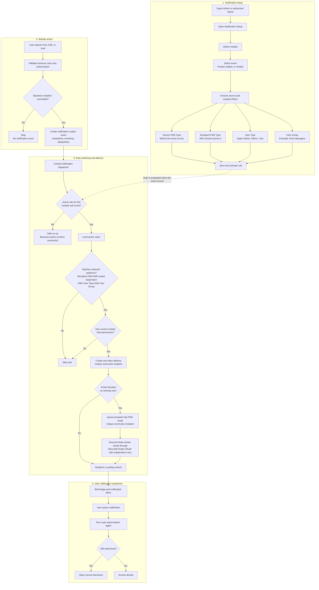

# Notification System Flow

This diagram explains how an administrator prepares a notification rule and how a successful module action becomes an in-app notification and, when enabled, an email notification.

Detailed design and reliability contract: [Notification System Design](./notification-system-design.md)

## Recipient matching

- Selections within one filter use **OR**. Example: `Broiler OR Breeder`.
- Different filters use **AND**. Example: `Source Hatchery AND Recipient Broiler AND Farm Managers`.
- Farm-targeted events use the catalog routing mode. Regular Admin/User recipients must be actively assigned to the document, origin, or destination farm selected by that mode; Super Admin retains the farm-assignment bypass.
- An empty filter means **Any** for that dimension.
- Only active users with the module's current View permission receive a delivery.
- A notification informs a user; it never grants module or document access.

## Reliability rules

- Failed or rolled-back Post, Edit, and Void operations create no event.
- When no active rule matches, notification processing is a safe no-op and does not change the completed business action.
- The deterministic deduplication key prevents retries from creating the same notification twice.
- Modules publish business events only. Recipient selection and delivery remain centralized.
