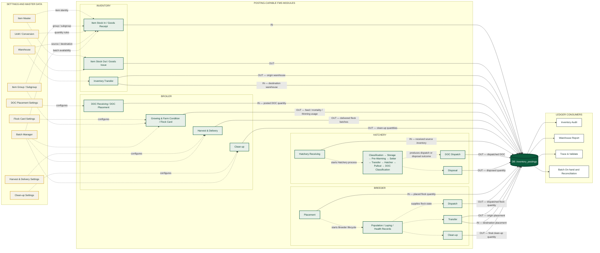

# Vita FMS Inventory Posting Architecture

## Reading the graph

- Solid arrows into `inventory_postings` represent ledger writes.
- `IN` increases stock in the target warehouse or inventory context.
- `OUT` reduces stock from the source warehouse or inventory context.
- Transfer modules create paired `OUT` and `IN` postings.
- Dashed arrows describe settings, master-data, or workflow dependencies and do not represent ledger writes.
- Inventory Audit, Warehouse Report, Trace & Validate, and reconciliation views read from the common ledger.

## Business-rule confirmation needed

The Broiler and general Inventory directions reflect the currently documented posting behavior. The exact posting direction and activation point for Hatchery DOC Dispatch, Hatchery Disposal, Breeder Placement, Breeder Dispatch, Breeder Transfer, and Breeder Clean-up should be confirmed against their authoritative Post mutations before this diagram is treated as a deployment contract.
